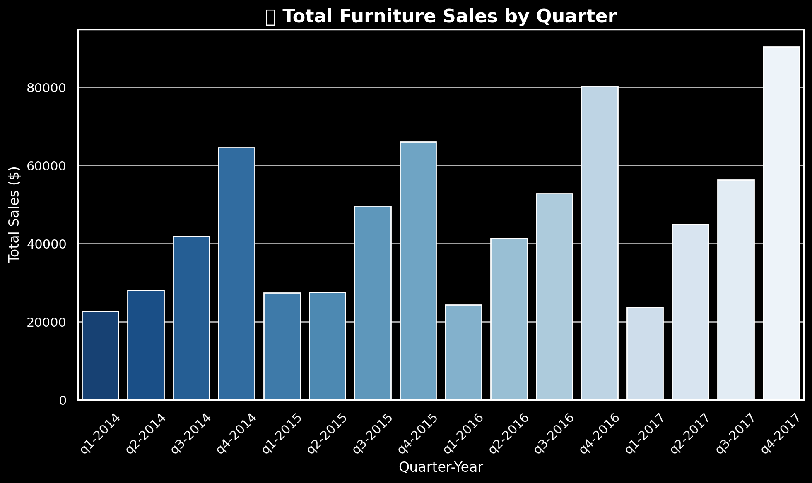
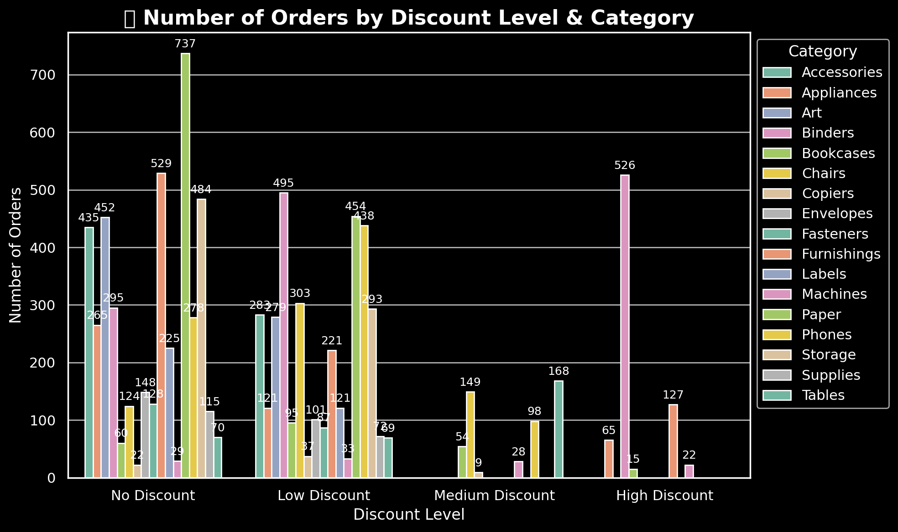
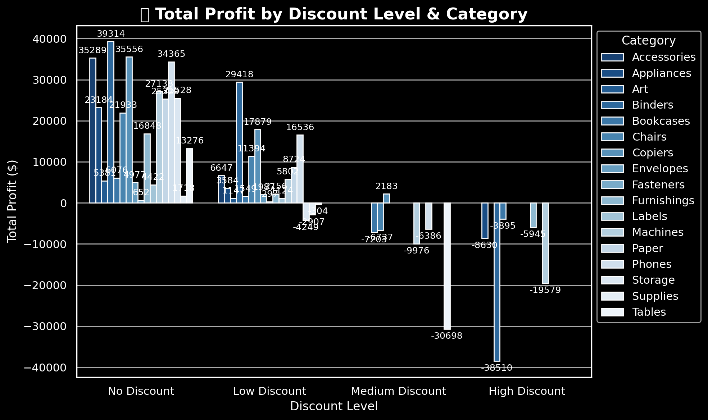
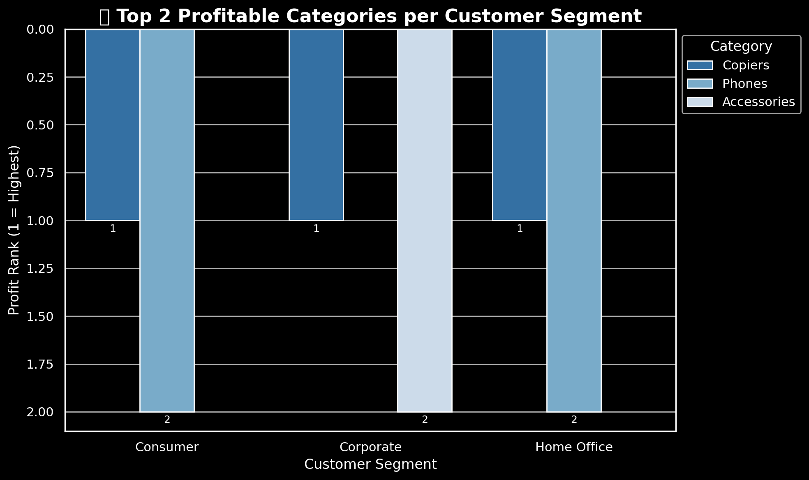

# SQL Portfolio Project: Sales & Profit Analysis for Furniture Business

## 🧾Introduction

Step into the world of retail analytics! This project explores how SQL can transform raw transactional data into valuable business insights — uncovering  sales trends,  discount impacts,  top-performing categories, and  employee profitability.

All SQL scripts can be found here: [project_sql folder](./sql_project)

## 🪴 Background

Driven by a passion to strengthen my SQL proficiency and replicate real business analysis scenarios, this project simulates how a retail company evaluates sales performance, profitability, and employee impact across multiple dimensions products, customers, and regions.

Using four interconnected tables Customers, Employees, Orders, and Products. I aimed to answer key business questions that reflect everyday analytical challenges: understanding what drives profit, how discounts affect revenue, and how to automate performance reports for decision-makers.

The dataset structure enabled exploration of end-to-end business analytics from data cleaning and summarization to creating reusable SQL logic through functions and stored procedures, just like a professional data analyst would do in an enterprise setting.

### 💡 The questions I wanted to answer through my SQL queries were:
1. What are the total sales of furniture products, grouped by each quarter of the year?
2. How do different discount levels impact sales performance and profit across product categories?
3. Which product categories perform best within each customer segment, based on sales and profit?
4. How does each employee perform across product categories, and what percentage of their total profit does each category represent?
5. How can a user-defined function (UDF) be created to calculate the profitability ratio for each product category sold by an employee?
6. How can a stored procedure be developed to calculate total sales and profit for a specific employee over a given date range?
7. How can a dynamic SQL query be used to calculate total profit for the last six quarters, pivoted by quarter and state?


## 🧰 Tools I Used
For this retail sales performance analysis, I leveraged several core tools to query, automate, and present insights effectively:
- SQL Server (T-SQL): The core query language used to analyze sales, profit, and performance data.
- Azure Data Studio: A powerful environment for writing, testing, and debugging SQL queries.
- Excel & Power BI: Used for quick validation and visualization of query results where necessary.

## 📊 The Analysis
Each query in this project explores a specific business problem that a data analyst might face in a retail company uncovering sales trends, profitability patterns, and operational performance. Here’s how I approached each question and the key insights derived from the analysis.

### 1. Quarterly Sales of Furniture Products
To evaluate sales trends, I analyzed total sales for all furniture products, grouped by each quarter of the year. This helped identify seasonality and performance consistency over time.

```
SELECT 
    CONCAT('q', DATEPART(quarter, order_date), '-', YEAR(order_date)) AS Quarter_Year,
    ROUND(SUM(sales), 2) AS Total_Sales
FROM orders
WHERE product_id LIKE 'FUR%'
GROUP BY YEAR(order_date), DATEPART(quarter, order_date)
ORDER BY YEAR(order_date), DATEPART(quarter, order_date);
```
Here’s the breakdown of total sales performance for furniture products by quarter:
- **Consistent Growth:** Sales rose steadily from Q1-2014 ($22.6K) to Q4-2014 ($64.5K), showing strong year-end momentum.
- **Seasonal Pattern:** Each year, Q4 outperforms other quarters — likely driven by holiday campaigns and seasonal purchases.
- **Demand Expansion:** The continuous quarterly increase signals expanding customer interest and effective marketing.
- **Actionable Insight:** Focus promotional spending and inventory ramp-up before Q4 to maximize profits.


*Bar Chart visualizing quarterly total sales for furniture products; ChatGPT generated this graph from my SQL query results*

### 2. Discount Level Impact on Sales Performance
This analysis examined how different discount levels affect both sales volume and profit margins across product categories. Discounts were categorized into:

No Discount (0)

Low Discount (0–0.2)

Medium Discount (0.2–0.5)

High Discount (> 0.5)

```
SELECT 
    p.Category,
    CASE 
        WHEN o.discount = 0 THEN 'No Discount'
        WHEN o.discount > 0 AND o.discount <= 0.2 THEN 'Low Discount'
        WHEN o.discount > 0.2 AND o.discount <= 0.5 THEN 'Medium Discount'
        WHEN o.discount > 0.5 THEN 'High Discount'
    END AS Discount_class,
    COUNT(DISTINCT o.order_id) AS Number_of_orders,
    ROUND(SUM(o.profit), 2) AS Total_profit
FROM orders AS o
LEFT JOIN product AS p
    ON o.product_id = p.id
GROUP BY 
    p.category,
    CASE 
        WHEN o.discount = 0 THEN 'No Discount'
        WHEN o.discount > 0 AND o.discount <= 0.2 THEN 'Low Discount'
        WHEN o.discount > 0.2 AND o.discount <= 0.5 THEN 'Medium Discount'
        WHEN o.discount > 0.5 THEN 'High Discount'
    END
ORDER BY 
    p.category, 
    discount_class;
```
Here’s the breakdown of sales and profit performance across discount levels:

**Number of Orders:**
- No Discount generated the highest order volumes across almost all categories — customers buy steadily even without incentives.
- Low Discounts (≤0.2) brought only a slight uplift in volume but not enough to surpass no-discount performance.
- High Discounts (>0.5) failed to drive significant volume — buyers didn’t react strongly to deep markdowns.

**Total Profit:**
- No Discount produced the highest profit margins and totals, proving full-price sales are the most valuable.
- Low Discounts remained profitable but with reduced margins.
- Medium and High Discounts led to profit erosion, especially in categories like Appliances and Storage where discounts exceeded 0.5.

**Key Takeaway:**
- No Discount = best overall strategy, maximizing both sales volume and profitability.
- Moderate, well-timed low discounts can complement marketing efforts but shouldn’t replace standard pricing.
- Avoid deep discounts unless offloading aging or slow-moving stock — they destroy profitability and offer limited sales benefit.


*Bar Chart visualizing total Sales by discount level accross product categories; ChatGPT generated this graph from my SQL query results*



*Bar Chart visualizing total Profit by discount level accross product categories; ChatGPT generated this graph from my SQL query results*


### 3. Top-Performing Product Categories by Customer Segment

To identify which product categories perform best within each customer segment, I ranked categories by total sales and profit, focusing on the top two per segment.

```
with category_summary as (
    select
        c.segment,
        p.category,
        sum(o.sales) as total_sales,
        sum(o.profit) as total_profit
    from orders as o
    inner join product as p
        on o.product_id = p.id
    inner join customer as c
        on o.customer_id = c.id
    group by c.segment, p.category
),
ranked as (
    select
        segment,
        category,
        rank() over (partition by segment order by total_sales desc) as sales_rank,
        rank() over (partition by segment order by total_profit desc) as profit_rank
    from category_summary
)
select
    *
from ranked
where profit_rank <= 2
order by segment, profit_rank;
```
Here’s the breakdown of the top-performing product categories by customer segment:

- Consumer Segment: Copiers and Phones lead profitability — high-value personal purchases.
- Corporate Segment: Copiers remain the strongest, followed by Accessories — driven by office procurement needs.
- Home Office Segment: Copiers again dominate, showing consistent performance across all segments.

**Key Takeaway:**
- Copiers are the undisputed profit leaders across all customer segments — a core product to prioritize in sales and inventory strategies.
- Segment-based marketing should emphasize Phones for consumers and Accessories for corporates.
- Strengthening promotions and supply chain efficiency around top categories can further boost profitability across all customer types.


*Clustered bar chart showing top 2 product categories by profit for each customer segment; ChatGPT generated this graph from my SQL query results*


