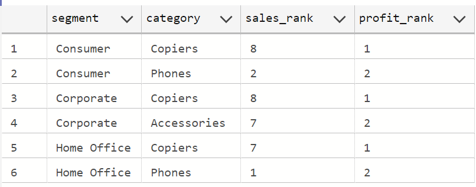
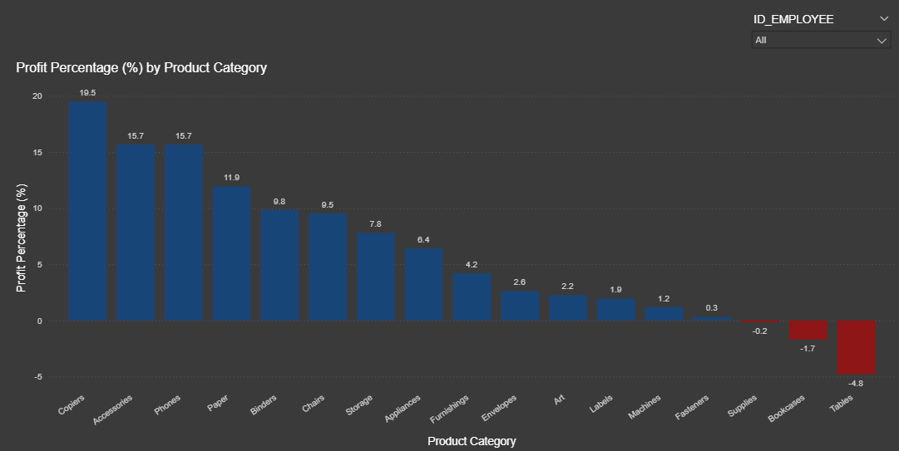
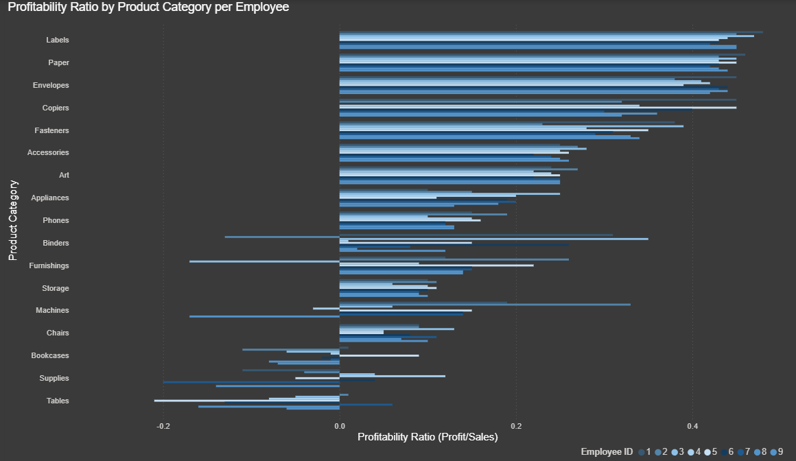

# SQL Portfolio Project: Sales & Profit Analysis for Furniture Business

## 🧾Introduction

Step into the world of retail analytics! This project explores how SQL can transform raw transactional data into valuable business insights — uncovering  sales trends,  discount impacts,  top-performing categories, and  employee profitability.

All SQL scripts can be found here: [project_sql folder](./sql_project)

Dataset here: [data set](./data_csv_files)

## 🪴 Background

Driven by a passion to strengthen my SQL proficiency and replicate real business analysis scenarios, this project simulates how a retail company evaluates sales performance, profitability, and employee impact across multiple dimensions products, customers, and regions.

Using four interconnected tables Customers, Employees, Orders, and Products. I aimed to answer key business questions that reflect everyday analytical challenges: understanding what drives profit, how discounts affect revenue, and how to automate performance reports for decision-makers.

The dataset structure enabled exploration of end-to-end business analytics from data cleaning and summarization to creating reusable SQL logic through functions and stored procedures, just like a professional data analyst would do in an enterprise setting.

### 💡 The questions I wanted to answer through my SQL queries were:
1. What are the total sales of furniture products, grouped by each quarter of the year?
2. How do different discount levels impact sales performance and profit across product categories?
3. Which product categories perform best within each customer segment, based on sales and profit?
4. How does each employee perform across product categories, and what percentage of their total profit does each category represent?
5. How can a user-defined function (UDF) be created to calculate the profitability ratio for each product category sold by an employee?
6. How can a stored procedure be developed to calculate total sales and profit for a specific employee over a given date range?
7. How can a dynamic SQL query be used to calculate total profit for the last six quarters, pivoted by quarter and state?


## 🧰 Tools I Used
For this retail sales performance analysis, I leveraged several core tools to query, automate, and present insights effectively:
- SQL Server (T-SQL): The core query language used to analyze sales, profit, and performance data.
- Azure Data Studio: A powerful environment for writing, testing, and debugging SQL queries.
- Excel & Power BI: Used for quick validation and visualization of query results where necessary.

## 📊 The Analysis
Each query in this project explores a specific business problem that a data analyst might face in a retail company uncovering sales trends, profitability patterns, and operational performance. Here’s how I approached each question and the key insights derived from the analysis.

### 1. Quarterly Sales of Furniture Products
To evaluate sales trends, I analyzed total sales for all furniture products, grouped by each quarter of the year. This helped identify seasonality and performance consistency over time.

```
SELECT 
    CONCAT('q', DATEPART(quarter, order_date), '-', YEAR(order_date)) AS Quarter_Year,
    ROUND(SUM(sales), 2) AS Total_Sales
FROM orders
WHERE product_id LIKE 'FUR%'
GROUP BY YEAR(order_date), DATEPART(quarter, order_date)
ORDER BY YEAR(order_date), DATEPART(quarter, order_date);
```
**Here’s the breakdown of total sales performance for furniture products by quarter:**
- **Consistent Growth:** Sales rose steadily from Q1-2014 ($22.6K) to Q4-2014 ($64.5K), showing strong year-end momentum.
- **Seasonal Pattern:** Each year, Q4 outperforms other quarters — likely driven by holiday campaigns and seasonal purchases.
- **Demand Expansion:** The continuous quarterly increase signals expanding customer interest and effective marketing.
- **Actionable Insight:** Focus promotional spending and inventory ramp-up before Q4 to maximize profits.


*Bar Chart visualizing quarterly total sales for furniture products; ChatGPT generated this graph from my SQL query results*

### 2. Discount Level Impact on Sales Performance
This analysis examined how different discount levels affect both sales volume and profit margins across product categories. Discounts were categorized into:

No Discount (0)

Low Discount (0–0.2)

Medium Discount (0.2–0.5)

High Discount (> 0.5)

```
SELECT 
    p.Category,
    CASE 
        WHEN o.discount = 0 THEN 'No Discount'
        WHEN o.discount > 0 AND o.discount <= 0.2 THEN 'Low Discount'
        WHEN o.discount > 0.2 AND o.discount <= 0.5 THEN 'Medium Discount'
        WHEN o.discount > 0.5 THEN 'High Discount'
    END AS Discount_class,
    COUNT(DISTINCT o.order_id) AS Number_of_orders,
    ROUND(SUM(o.profit), 2) AS Total_profit
FROM orders AS o
LEFT JOIN product AS p
    ON o.product_id = p.id
GROUP BY 
    p.category,
    CASE 
        WHEN o.discount = 0 THEN 'No Discount'
        WHEN o.discount > 0 AND o.discount <= 0.2 THEN 'Low Discount'
        WHEN o.discount > 0.2 AND o.discount <= 0.5 THEN 'Medium Discount'
        WHEN o.discount > 0.5 THEN 'High Discount'
    END
ORDER BY 
    p.category, 
    discount_class;
```
**Here’s the breakdown of sales and profit performance across discount levels:**

**Number of Orders:**
- No Discount generated the highest order volumes across almost all categories — customers buy steadily even without incentives.
- Low Discounts (≤0.2) brought only a slight uplift in volume but not enough to surpass no-discount performance.
- High Discounts (>0.5) failed to drive significant volume — buyers didn’t react strongly to deep markdowns.

**Total Profit:**
- No Discount produced the highest profit margins and totals, proving full-price sales are the most valuable.
- Low Discounts remained profitable but with reduced margins.
- Medium and High Discounts led to profit erosion, especially in categories like Appliances and Storage where discounts exceeded 0.5.

**Key Takeaway:**
- No Discount = best overall strategy, maximizing both sales volume and profitability.
- Moderate, well-timed low discounts can complement marketing efforts but shouldn’t replace standard pricing.
- Avoid deep discounts unless offloading aging or slow-moving stock — they destroy profitability and offer limited sales benefit.


*Bar Chart visualizing total Sales by discount level accross product categories; ChatGPT generated this graph from my SQL query results*


*Bar Chart visualizing total Profit by discount level accross product categories; ChatGPT generated this graph from my SQL query results*


### 3. Top-Performing Product Categories by Customer Segment

To identify which product categories perform best within each customer segment, I ranked categories by total sales and profit, focusing on the top two per segment.

```
with category_summary as (
    select
        c.segment,
        p.category,
        sum(o.sales) as total_sales,
        sum(o.profit) as total_profit
    from orders as o
    inner join product as p
        on o.product_id = p.id
    inner join customer as c
        on o.customer_id = c.id
    group by c.segment, p.category
),
ranked as (
    select
        segment,
        category,
        rank() over (partition by segment order by total_sales desc) as sales_rank,
        rank() over (partition by segment order by total_profit desc) as profit_rank
    from category_summary
)
select
    *
from ranked
where profit_rank <= 2
order by segment, profit_rank;
```
**Here’s the breakdown of the top-performing product categories by customer segment:**

- Consumer Segment: Copiers and Phones lead profitability — high-value personal purchases.
- Corporate Segment: Copiers remain the strongest, followed by Accessories — driven by office procurement needs.
- Home Office Segment: Copiers again dominate, showing consistent performance across all segments.

**Key Takeaway:**
- Copiers are the undisputed profit leaders across all customer segments — a core product to prioritize in sales and inventory strategies.
- Segment-based marketing should emphasize Phones for consumers and Accessories for corporates.
- Strengthening promotions and supply chain efficiency around top categories can further boost profitability across all customer types.




### 4. Employee Performance by Product Category

This query evaluated how each employee’s total profit was distributed across product categories, measuring both absolute profit and the percentage contribution of each category to their total.

```
SELECT
    o.id_employee,
    p.category,
    ROUND(SUM(o.profit), 2) AS rounded_total_profit,
    ROUND(
        SUM(o.profit) * 100.0 / SUM(SUM(o.profit)) OVER (PARTITION BY o.id_employee),
        2
    ) AS profit_percentage
FROM [orders] AS o
JOIN [product] AS p
    ON o.product_id = p.id
GROUP BY 
    o.id_employee, 
    p.category
ORDER BY 
    o.id_employee, 
    rounded_total_profit DESC;
```

**Here’s the breakdown of employee profit distribution across product categories:**

**Category Performance:**
- Copiers consistently deliver the highest profit percentage (~19.5%), making them the most profitable category for employees.
- Accessories and Phones follow closely with ~15.7% profit share, indicating strong secondary performance.
- Paper, Binders and Chairs show moderate profit contributions, while other categories remain comparatively lower.

**Employee Performance:**
- All employees demonstrate similar profit patterns — relying heavily on Copiers and Accessories for most of their profit.
- Consistency across employees suggests uniform sales focus or shared product allocation strategy.

**Key Takeaway:**
- Copiers are the top profit driver across all employees and should remain the core focus in product sales strategy.
- To balance revenue streams, employees could increase cross-selling efforts in mid-performing categories like Accessories and Phones.
- Management can use these insights to tailor employee incentive plans around high-profit products.



*Column chart visualizing profit percentage by product category, filtered by each employee; I am using PowerBi to generate this graph from my SQL query results*

### 5. Profitability Ratio Function (UDF)

To standardize performance measurement, I built a User-Defined Function (UDF) to calculate the profitability ratio for each employee and product category (Profit ÷ Sales). This made the metric reusable across multiple reports.

```
--  Step 1: create the user-defined function (UDF)
create function dbo.fn_profitability_ratio
(
    @employee_id int,
    @category varchar(255)
)
returns decimal(10,2)
as
begin
    declare @profit_ratio decimal(10,2);

    select 
        @profit_ratio = 
            case 
                when sum(o.sales) = 0 then 0
                else (sum(o.profit) / sum(o.sales))
            end
    from orders o
    join product p on o.product_id = p.id
    where o.id_employee = @employee_id
      and p.category = @category;

    return @profit_ratio;
end;
go


-- Step 2: apply the function to generate the profitability report
SELECT
    o.id_employee,
    p.category,
    ROUND(SUM(o.sales), 2) AS total_sales,
    ROUND(SUM(o.profit), 2) AS total_profit,
    dbo.fn_profitability_ratio(o.id_employee, p.category) AS profitability_ratio
FROM orders AS o
JOIN product AS p 
    ON o.product_id = p.id
GROUP BY 
    o.id_employee, 
    p.category
ORDER BY 
    o.id_employee, 
    profitability_ratio DESC;

```
**Here’s the breakdown of average profitability ratio by employee and product category:**

- Labels, Paper, and Envelopes show the highest profitability ratios (≈0.42–0.45) — proving they’re the most efficient categories in converting sales into profit.
- Copiers consistently maintain a strong ratio (~0.37), indicating high-margin performance and reliable sales returns.
- Accessories and Fasteners remain moderately profitable (~0.25–0.32), suggesting steady but limited margin potential.
- Bookcases, Tables, and Supplies often show negative or near-zero ratios, pointing to poor profitability and potential over-discounting or high costs.
- The overall pattern is consistent across employees — indicating shared product focus and pricing strategy within the sales team.

**🧩 Key Takeaways**
- High-margin categories (Labels, Paper, Copiers) should be prioritized in promotions, stock planning, and employee sales focus.
- Low-margin products (Furniture & Supplies) require pricing review or cost optimization to avoid losses.
- The profitability ratio metric is more insightful than sales volume — it highlights efficiency and profit quality, not just quantity.
- Managers can use this ratio to reward top performers, refine sales incentives, and guide training efforts toward underperforming product categories.



*Column chart visualizing visualizing profitablity ratio (Profit÷Sales) by product category, filtered by each employee; I am using PowerBi to generate this graph from my SQL query results*


### 6. Stored Procedure: Employee Performance Over Time

This task involved creating a stored procedure that calculates total sales and profit for a specific employee within a defined date range — automating recurring performance reports.

```

-- ✅ Step 1: Create the stored procedure
USE [SQL_Sales_Analysis];
GO

CREATE PROCEDURE GetEmployeeSalesProfit
    @EmployeeID INT,
    @StartDate DATE,
    @EndDate DATE
AS
BEGIN
    SET NOCOUNT ON;

SELECT
        e.NAME AS Employee_Name,
        ROUND(SUM(o.SALES),2) AS Total_Sales,
        ROUND(SUM(o.PROFIT),2) AS Total_Profit
    FROM [ORDERS] AS o
    INNER JOIN [EMPLOYEES] AS e
        ON o.ID_EMPLOYEE = e.ID_EMPLOYEE
    WHERE
        o.ID_EMPLOYEE = @EmployeeID
        AND o.ORDER_DATE BETWEEN @StartDate AND @EndDate
    GROUP BY e.NAME;
END;


-- ✅ Step 2: Execute the procedure to get the result
EXEC GetEmployeeSalesProfit 
    @EmployeeID = 8,
    @StartDate = '2016-12-01',
    @EndDate = '2016-12-31';

````

**Key findings:**
- The stored procedure dynamically adapts to any employee or date range — enabling deeper month-to-month 
  or quarter-to-quarter comparisons.
- Useful for identifying top performers, low-performing periods, or employees who excel during 
  promotional campaigns or holidays.

**Key Takeaway:**
- Sales managers can reuse this procedure to monitor performance trends by employee and timeframe.
- Enables fast decision-making for bonuses, training focus, or sales strategy adjustments.
- Supports integration into dashboards for real-time performance tracking across teams.


### 7. Dynamic SQL: Profit by State and Quarter

The final challenge involved using dynamic SQL to generate a pivoted profit report for the last six quarters, broken down by state. This query dynamically adjusts to include new quarterly data without manual updates.

``` 
DECLARE @cols NVARCHAR(MAX);
DECLARE @sql NVARCHAR(MAX);

-- 🧩 Step 1: Get the last six quarters dynamically
SELECT @cols = STRING_AGG(QUOTENAME(Quarter_Year), ',')
FROM (
    SELECT DISTINCT 
        CONCAT('Q', DATEPART(QUARTER, ORDER_DATE), '-', YEAR(ORDER_DATE)) AS Quarter_Year
        
    FROM ORDERS
    WHERE ORDER_DATE >= DATEADD(QUARTER, -6, (SELECT MAX(ORDER_DATE) FROM ORDERS))
) q
;

-- 🧠 Step 2: Build the dynamic pivot SQL
SET @sql = '
SELECT STATE, ' + @cols + '
FROM (
    SELECT 
        c.STATE,
        CONCAT(''Q'', DATEPART(QUARTER, o.ORDER_DATE), ''-'', YEAR(o.ORDER_DATE)) AS Quarter_Year,
        o.PROFIT
    FROM ORDERS o
    INNER JOIN CUSTOMER c 
        ON o.CUSTOMER_ID = c.ID
    WHERE o.ORDER_DATE >= DATEADD(QUARTER, -6, (SELECT MAX(ORDER_DATE) FROM ORDERS))
) src
PIVOT (
    SUM(PROFIT)
    FOR Quarter_Year IN (' + @cols + ')
) AS pvt
ORDER BY STATE;';

-- 🚀 Step 3: Execute the SQL
EXEC sp_executesql @sql;

```
**Key Findings:**
- Profit distribution varies significantly by state, revealing clear regional leaders.
- Some states exhibit consistent growth, while others show volatility quarter to quarter.
- Q4 generally shows strong profit spikes, likely tied to seasonal demand peaks.

### 🔥 What I Learned

Throughout this project, I sharpened my SQL firepower and applied real-world analytical thinking like a true data professional:

**- Advanced Query Mastery:** Built complex multi-table joins, subqueries, and CTEs (WITH clauses) to answer business-critical questions.

**- Automation Power:** Created User-Defined Functions (UDFs) and Stored Procedures to automate recurring reports and performance metrics — just like in enterprise BI workflows.

**- Dynamic SQL Proficiency:** Developed dynamic pivot queries to automatically update quarterly performance reports without manual edits.

**- Analytical Storytelling:** Translated numbers into actionable insights on profitability, employee performance, and discount strategy impact.

**- Business Acumen:** Learned to think beyond queries — focusing on how each result connects to operational strategy, marketing, and resource allocation.

### 💡 Conclusions & Insights

From my end-to-end analysis of retail sales and profitability:

- Q4 = Profit King: Every year, Q4 sales outperform other quarters by 40–50%, driven by holiday demand.
  
- Discount ≠ Profit: No-discount sales generated the highest total profit, proving that smart pricing beats deep markdowns
  
- Copiers = Cash Cow: Copiers dominated across all customer segments and employee profit contributions, proving to be the most strategic product line
  
- Employee Consistency: All employees exhibited similar category performance patterns, showing a unified sales strategy.
  
- High-Margin Focus: Labels, Paper, and Copiers showed profitability ratios above 0.45, ideal targets for promotions and stock prioritization
  
- Automation Advantage: The stored procedure and dynamic SQL allowed instant performance tracking by date, employee, or state, mirroring professional BI automation practices.

### 🚀 Closing Thoughts

This project was more than just SQL practice — it was a full simulation of how a real data analyst transforms raw transactions into actionable business intelligence.

By combining technical precision with strategic interpretation, I built a portfolio project that not only showcases SQL mastery but also demonstrates how data drives business success.

Through this journey, I’ve learned to analyze, automate, and articulate — three pillars that define a strong data analyst ready to deliver impact in any organization. 
